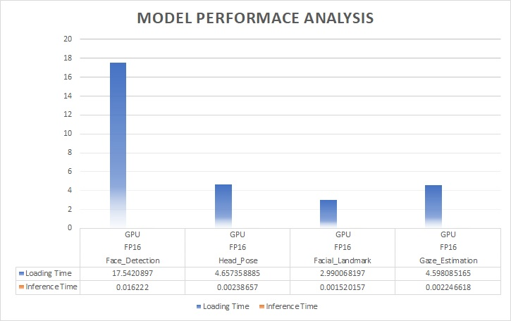

# Computer Pointer Controller

### Introduction

Control the mouse pointer of your computer is by head & eyes. 

Controlling your computer mouse pointer via your eyes and head pose is really a magic application. It uses head pose with left & right eyes for prediction of target place with moving distance then change mouse pointer position accordingly. 

Gaze Estimation model is used to estimate the gaze of the user's eyes 

This project will demonstrate how multiple models can run in the same machine and coordinate the flow of streaming data among them to achieve the control of the mouse as mentioned.

### NN Models used for OpenVino's inference

The InferenceEngine API from Intel's OpenVINO ToolKit is used to build the project. 

To get these inputs, 4 models are required:
- Face Detection 
- Head Pose Estimation 
- Facial Landmarks Detection
- Gaze Estimation

The gaze estimation model requires three inputs (cropped from input stream via face detection model):
- The head pose
- The left eye image 
- The right eye image 

### Project Structure and files

- ***Structure***
```
.
├── final-project
│   ├── app-run.sh
│   ├── bin
│   │   └── demo.mp4
│   ├── models
│   │   └── intel
│   │       ├── face-detection-adas-0001
│   │       │   ├── FP16
│   │       │   │   ├── face-detection-adas-0001.bin
│   │       │   │   └── face-detection-adas-0001.xml
│   │       │   ├── FP16-INT8
│   │       │   │   ├── face-detection-adas-0001.bin
│   │       │   │   └── face-detection-adas-0001.xml
│   │       │   └── FP32
│   │       │       ├── face-detection-adas-0001.bin
│   │       │       └── face-detection-adas-0001.xml
│   │       ├── gaze-estimation-adas-0002
│   │       │   ├── FP16
│   │       │   │   ├── gaze-estimation-adas-0002.bin
│   │       │   │   └── gaze-estimation-adas-0002.xml
│   │       │   ├── FP16-INT8
│   │       │   │   ├── gaze-estimation-adas-0002.bin
│   │       │   │   └── gaze-estimation-adas-0002.xml
│   │       │   └── FP32
│   │       │       ├── gaze-estimation-adas-0002.bin
│   │       │       └── gaze-estimation-adas-0002.xml
│   │       ├── head-pose-estimation-adas-0001
│   │       │   ├── FP16
│   │       │   │   ├── head-pose-estimation-adas-0001.bin
│   │       │   │   └── head-pose-estimation-adas-0001.xml
│   │       │   ├── FP16-INT8
│   │       │   │   ├── head-pose-estimation-adas-0001.bin
│   │       │   │   └── head-pose-estimation-adas-0001.xml
│   │       │   └── FP32
│   │       │       ├── head-pose-estimation-adas-0001.bin
│   │       │       └── head-pose-estimation-adas-0001.xml
│   │       └── landmarks-regression-retail-0009
│   │           ├── FP16
│   │           │   ├── landmarks-regression-retail-0009.bin
│   │           │   └── landmarks-regression-retail-0009.xml
│   │           ├── FP16-INT8
│   │           │   ├── landmarks-regression-retail-0009.bin
│   │           │   └── landmarks-regression-retail-0009.xml
│   │           └── FP32
│   │               ├── landmarks-regression-retail-0009.bin
│   │               └── landmarks-regression-retail-0009.xml
│   ├── requirements.txt
│   ├── results
│   │   └── ...
│   └── src
│       ├── face_detection.py
│       ├── facial_landmark_detection.py
│       ├── gaze_estimation.py
│       ├── head_pose_estimation.py
│       ├── input_feeder.py
│       ├── main.py
│       ├── model_facilitator.py
│       └── mouse_controller.py
├── images
└── README.md
```

- The *bin* folder contains the video for testing the presented code, where an instructor from the Udacity Edge AI nanodegree program making gaze and head movements for the control of the mouse cursor. 
- The *models* folder contains all intel's pre-trained models required for the gaze tracking inference, each of them contains models with different precisions. 
- The *src* folder contains all python classes and modules needed for the implementation of the model. More information about each of these files can be seen when opening them. 

## Project Set Up and Installation
#### HW Requirement
-   6th to 10th generation Intel® Core™ processor with Iris® Pro graphics or Intel® HD Graphics.
-   VPU - Intel® Neural Compute Stick 2 (NCS2)

#### OpenVINO Requirements

- Make sure related HWs to meet the note of the [hardware requirements](https://software.intel.com/content/www/us/en/develop/tools/openvino-toolkit/system-requirements.html) for the Intel® Distribution of OpenVINO™ Toolkit.

- For exercises with an [Intel® Neural Compute Stick 2](https://software.intel.com/content/www/us/en/develop/articles/intel-neural-compute-stick-2-and-open-source-openvino-toolkit.html), please refer instructions setup for specific operating system.

### Installing OpenVINO in Linux

- OpenVINO can be download for Linux via follow link [instructions](https://software.intel.com/content/www/us/en/develop/tools/openvino-toolkit/download.html).

- Instructions for installation in Linux [here](https://docs.openvinotoolkit.org/latest/openvino_docs_install_guides_installing_openvino_linux.html).

### Getting project files:

Clone this repository to get all required files to run the code.

### Python Environment

This projects is developed based on Python3. Preparing python3 enviroments and activated, the required modules can be installed using the following command,

- pip3 install -r final-project\requirements.txt

### Activating the OpenVINO environment

source ~/opt/intel/openvino/bin/setupvars.sh

### Downloading the required OpenVINO pretrained models

- If running on a local computer in order to get the required pre-trained OpenVINO model it is required to source the OpenVINO variables: source ~/opt/intel/openvino/bin/setupvars.sh

- If running on a Raspberrypi OpenVINO installation, the git clone --depth 1 https://github.com/openvinotoolkit/open_model_zoo repository needs to be clone to: ~/opt/intel/openvino/deployment_tools

Next, the following OpenVINO pre-trained models are required to run this project, instructions to get then using the OpenVINO downloader are also presented.

    python3 /opt/intel/openvino_2021/deployment_tools/open_model_zoo/tools/downloader/downloader.py --name face-detection-adas-0001
    python3 /opt/intel/openvino_2021/deployment_tools/open_model_zoo/tools/downloader/downloader.py --name head-pose-estimation-adas-0001
    python3 /opt/intel/openvino_2021/deployment_tools/open_model_zoo/tools/downloader/downloader.py --name landmarks-regression-retail-0009
    python3 /opt/intel/openvino_2021/deployment_tools/open_model_zoo/tools/downloader/downloader.py --name gaze-estimation-adas-0002

## Demo


My HWs: Intel NUC (x1) + NCS2 (x1)


Please use **app-run.sh** to launch demo in terminal after user login via window UI in X-server.

For example, do inference via CPU & GPU

    python3 src/main.py \
    --face_model models/intel/face-detection-adas-0001/FP16/face-detection-adas-0001 \
    --head_model models/intel/head-pose-estimation-adas-0001/FP16/head-pose-estimation-adas-0001 \
    --facial_landmark_model models/intel/landmarks-regression-retail-0009/FP16/landmarks-regression-retail-0009 \
    --gaze_model models/intel/gaze-estimation-adas-0002/FP16/gaze-estimation-adas-0002 \
    -i bin/demo.mp4 \
    -d GPU_CPU_CPU_CPU \
    -o results/ \
    --mouse_speed fast \
    --mouse_precision medium \
    --markers True

Please refer the video demo via this [link](https://bre.is/KGQKcyUx)

## Documentation

The use of the code contained in this project is explained next:

    usage: main.py [-h]  \
    --face_model [model path] \
    --head_model [model path] \
    --facial_landmark_model [model path] \
    --gaze_model [model path] \
    -i bin/demo.mp4 \
    -d [device_device_device_evice] \
    -o [output path] \
    --mouse_speed fast \
    --mouse_precision medium \
    --markers True

***required arguments:***

    --face_model for face detection mode
    --facial_landmark_model for landmarks regression retail
    --head_model for head-pose estimation model
    --gaze_model for gaze estimation model
    -i is for input file (picture, video and cam)
    -d device type (CPU, GPU, MYRIAD)

***optional arguments:***

    -spd < MOUSE_SPEED >, --mouse_speed < MOUSE_SPEED >, *Speed to which the mouse cursor move per instruction, valid options are: slow, medium, fast.*
    -prcs < MOUSE_PRECISION >, --mouse_precision < MOUSE_PRECISION >, *Amount of precision for the mouse movements, valid options are: low, medium, high.*
    -l < CPU_EXTENSION_PATH >, --cpu_extension < CPU_EXTENSION_PATH >, *Path to layer extension in case it is incompatible with the device architecture.*
    -d < DEVICE_NAME >, --device < DEVICE_NAME >, *Specify the target device to infer on: CPU, GPU, FPGA or MYRIAD is acceptable. In this project, since four models are needed, the devices used shold be defines such as: Device1_Device2_Device3_Device4.*
    -pf < THRESHOLD_VALUE >, --thresh < THRESHOLD_VALUE >, *Probability threshold for detections filtering(0.6 by default)*
    -mks < MARKER_FLAG >, --markers < MARKER_FLAG >, *Flag used to display markers that identify the models used outputssuch as faces, eyes landmarks and head position angles. valid flag values are False and True.*

For more information you can run  `python3 src/main.py -h`

## Benchmarks

### CPU (Intel NUC w/ i7-10710U CPU @ 1.10GHz) with FP16

- *Device*


- *Summary*


### Integrated GPU (Intel UHD Graphics 620) with FP16

- *Device*



- *Summary*


### CPU + GPU + VPU (MYRIAD NCS2 x1) with FP16

- *Device*


- *Summary*


### GPU + CPU + VPU (MYRIAD NCS2 x1) with FP16

- *Device*


- *Summary*


### VPU (MYRIAD NCS2 x1) + CPU + GPU with FP16

- *Device*


- *Summary*


### VPU (MYRIAD NCS2 x1) + CPU with FP16

- *Device*


- *Summary*


### Model Comparation with CPU (Intel NUC w/ i7-10710U CPU @ 1.10GHz) among FP32 and FP16

- *Device*


- *Summary*


### Model Comparation with Integrated GPU (Intel UHD Graphics 620) with FP16 among FP32 and FP16

- *Device*


- *Summary*


## Results

In conclusion, we can see performance almost the same in all FP32/FP16-INT8/FP16 models but the model with `FP16` in weight format has lowest inference time. So I use it as baseline for comparting performance among CPU, GPU, and NCS2. BTW it is also surprised to me on model loading,  *model loading with FP32 format is faster than FP16's one*.

It was observed in the ***Benchmarks*** section for performance, the *CPU* devices are faster than others. They load the model, make predictions and handle one input-output processing in the smallest times. The second-best device, in term of speed, is the *GPU*, however, the only real difference in terms of performance is it s model loading times, given that the inference and input-output times is small but suffers overhead of model loading. On the other hand, the *NSC2* devices used shows that it is possible to implement the desired task based on them. Nonetheless, its performance with single 1 NSC2 are not the most suitable devices for this project, at least only one VPU device is not enough capacity for inference in this program.

There are many factors for considering on which device is better for the implementation the control of the mouse cursor based on gaze tracking. If one VPU device is used for each of the required tasks, then the performance for that solution should increase highly, especially when considering that all of the can run in parallel. However, the cost of that solution will increase too. 

Because CPU resource is valuable, It would be also nice to adapt CPU and GPU when using only 1 unit of NSC2. It appears following combinations of inference,  **CPU_GPU_GPU_MYRIAD** (execution time: *~10+ secs*) and **MYRIAD_CPU_CPU_GPU** (execution time: *~7+ secs*), will bring high effective and efficiency (not so fast but fewer model loading time) between capacity and cost of inference devices for this program. From my perspective, it is important to chase high benefits from running devices (including good results) with the smallest possible cost for business.

Thanks
Gary